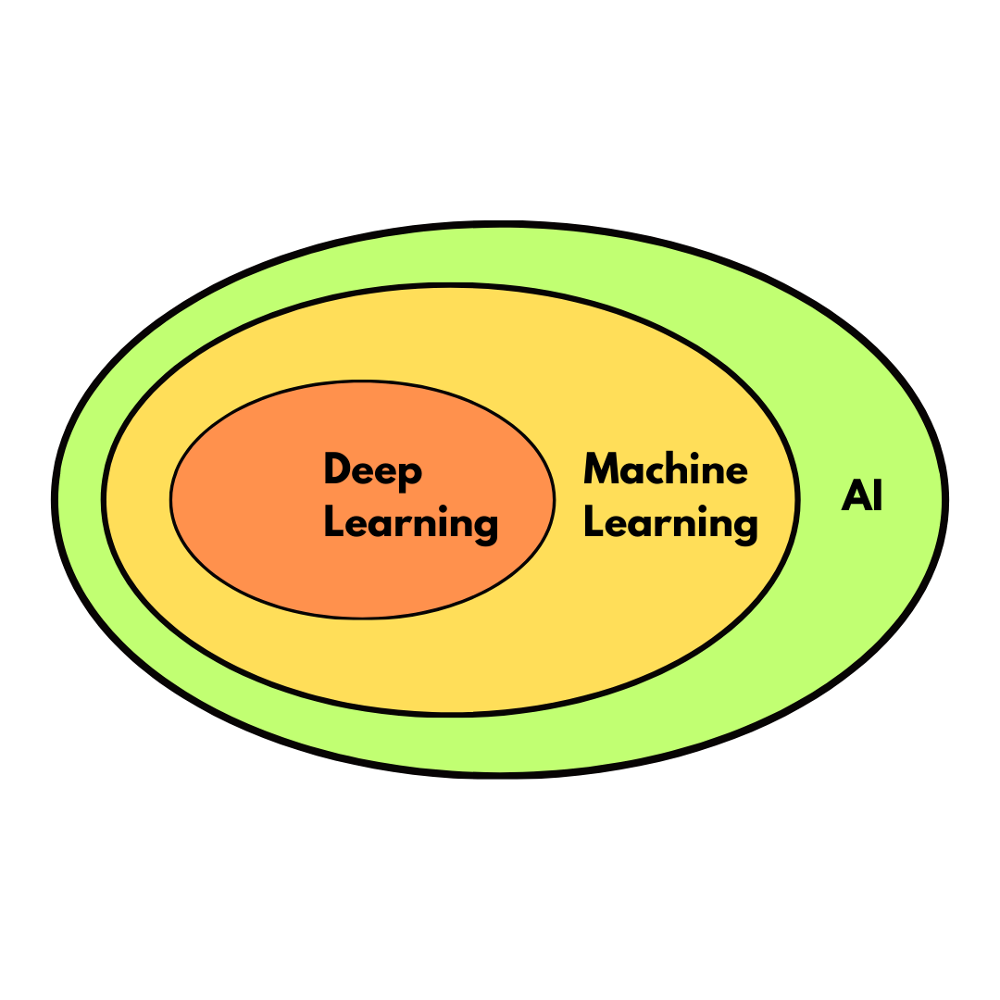
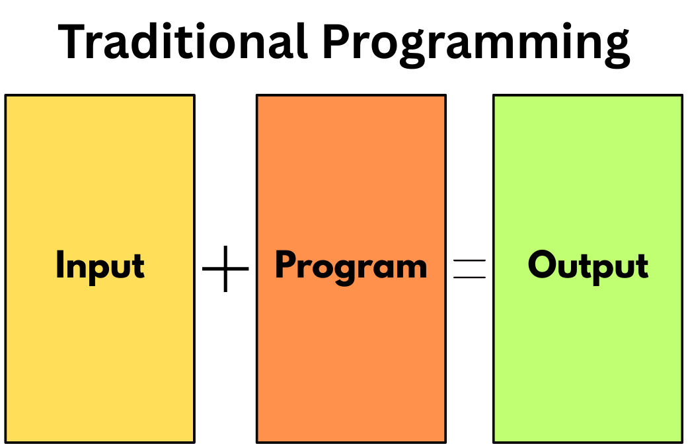
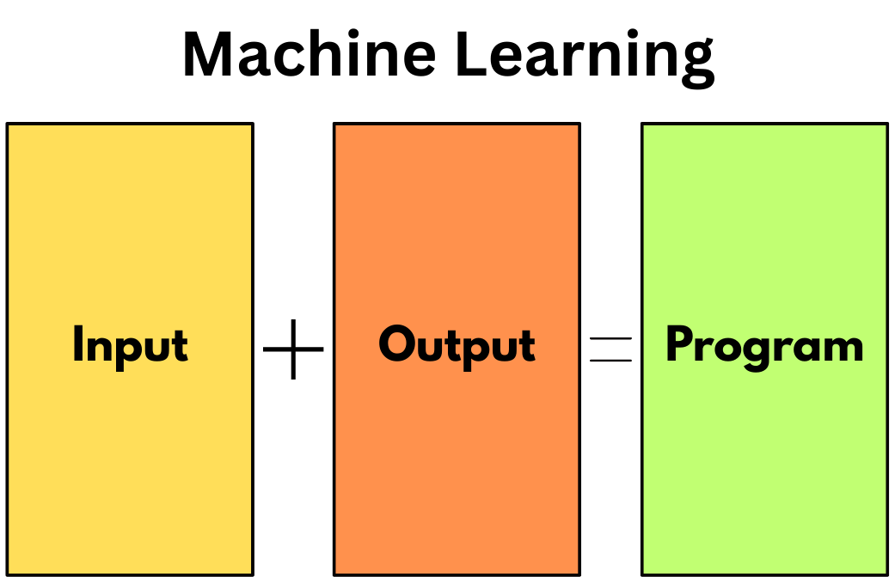

# Module 1 - Introduction to Machine Learning

## What is Machine Learning?

Machine Learning involves developing algorithms to learn patterns from data, allowing computers to make predictions or decisions without being explicitly programmed for every task.

- Machine Learning is a subset of AI
- It learns from the data instead of the hard-coded rules
- It identifies pattern and relationship in data
- It is used for prediction, classification and decision-making

---

## Traditional Programming vs Machine Learning

<table>
  <tr>
    <th>Traditional Programming</th>
    <th>Machine Learning</th>
  </tr>
  <tr>
    <td align="center">
        
    </td>
    <td align="center">
        
    </td>
  </tr>
  <tr>
    <td>Data + Rules → Output</td>
    <td>Data + Output → Model</td>
  </tr>
  <tr>
    <td>Rules are manually written by developers</td>
    <td>Model learns rules automatically from data</td>
  </tr>
  <tr>
    <td>Works well for fixed, rule-based problems</td>
    <td>Works well for pattern-based and complex problems</td>
  </tr>
  <tr>
    <td>Logic is explicitly defined</td>
    <td>Logic is learned from examples</td>
  </tr>
  <tr>
    <td>Output is deterministic based on code</td>
    <td>Output improves as more data is provided</td>
  </tr>
</table>

---

## Types of Machine Learning

### Supervised Learning
- Uses labeled data (input + correct output)
- Learns to map inputs to outputs
- Used for prediction and classification
- Examples: house price prediction, spam detection
  
### Unsupervised Learning
- Uses unlabeled data (no correct output given)
- Finds hidden patterns or groupings in data
- Used for clustering and pattern discovery
- Examples: customer segmentation, anomaly detection
  
### Self-supervised Learning
- Creates labels from the data itself
- Learns patterns without manually labeled data
- Often used in large AI models
- Example: predicting missing words in a sentence
  
### Semi-Supervised Learning
- Uses a small amount of labeled data and a large amount of unlabeled data
- Combines supervised and unsupervised approaches
- Useful when labeling data is expensive
- Example: image classification with limited labeled images
  
### Reinforcement Learning
- Learns by interacting with an environment
- Uses rewards and penalties to improve decisions
- Focuses on maximizing long-term rewards
- Examples: game-playing AI, robotics control

---

## Common ML Algorithms

### Prediction Algorithms
- Used when the output is a continuous value
- Predicts numerical results
- Examples:
  - Linear Regression
  - Polynomial Regression
  - Decision Tree Regressor
  - Random Forest Regressor
  - Support Vector Regressor (SVR)

### Classification Algorithms
- Used when the output is a category or label
- Predicts discrete classes
- Examples:
  - Logistic Regression
  - K-Nearest Neighbors (KNN)
  - Decision Tree Classifier
  - Random Forest Classifier
  - Support Vector Machine (SVM)
  - Naive Bayes

---

## Role of Mathematics in Machine Learning

Machine Learning relies on mathematics, statistics, and optimization techniques.

- **Linear Algebra:** Represents data using vectors and matrices and performs calculations to generate predictions.
  *Example:* A house price prediction model multiplies input features (size, rooms) with weights to produce an output.

- **Calculus:** Helps minimize prediction error and optimize model parameters.
  *Example:* Gradient Descent adjusts model weights to reduce the difference between predicted and actual values.

- **Probability:** Handles uncertainty and supports decision-making in predictions.
  *Example:* A spam detection model estimates the probability that an email belongs to the "spam" category.

- **Statistics:** Analyzes data patterns, distributions, and performance metrics.
  *Example:* Calculating mean and standard deviation to understand data spread.

- **Optimization:** Improves model accuracy by reducing loss step by step.
  *Example:* Iteratively updating model parameters until error becomes minimal.

Mathematics forms the foundation that enables machine learning models to learn from data and make reliable predictions.

---

## Where ML Fits in Modern Software Systems

- Integrated inside web and mobile applications
- Used in backend services to make predictions
- Connected through APIs
- Runs alongside databases and cloud infrastructure

Machine learning acts as a decision-making component inside software systems.

---

## Real-World Applications

- Recommendation systems (movies, products)
- Spam and fraud detection
- Face and speech recognition
- Chatbots and virtual assistants
- Demand and price prediction
- Customer behavior analysis